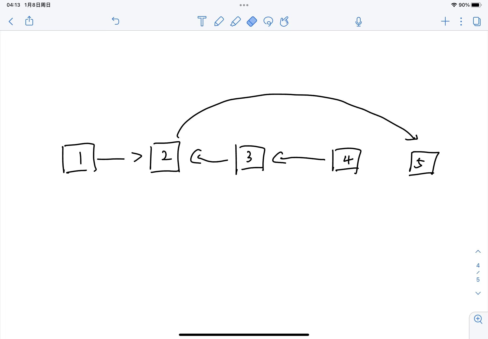

# 链表类题目

技巧1：基本上所有链表题目都可以再开始循环前，套用一个哨兵指针，来保证开头处理与后续循环中处理一致。
技巧2：在遇到需要处理特殊情况时，可以在第一个初始赋值时附上特殊值，后续正常循环。
技巧3：基本上大部分链表题目都可以用双指针完成。

在做题时，先画图，想好每次迭代时需要的各种操作，然后把小操作分割写成method
Example:
每 k 个节点一组翻转链表:
首先，最直观的思路就是链表的每k个节点翻转一次， 再把接下来k个翻转一次，直到剩下的node的数量低于k个。

翻转k个节点非常简单，思路与**反转一个单链表**大致一样，但是有一点是不一样的，在反转单链表中，原先的head在反转后会指向null，但是在这道题目中，原先的head需要指向下一个k gourp中的head。
那么，对于这个循环来说，需要对head指针做特殊处理，而其他操作一样，所以就可以使用上面的技巧2.代码如下：

```java
public ListNode[] reverseK(ListNode head, ListNode tail) {
    ListNode[] result = new ListNode[]{tail, head};

    ListNode prev = tail.next;
    ListNode curr = head;
    while (prev != tail) {
        ListNode next = curr.next;
        curr.next = prev;
        prev = curr;
        curr = next;
    }
    return result;
}
```

首先，这个指针的头指针会指向下一个k group的head，就是当前tail的next，所以我们初始赋值prev为tail.next而不是null，其余操作则和正常的反转链表一样即可。
但是，这个函数在反转后仍然后有问题，如果现在有一个链表{1,2,3,4,5}，我们如果对2,3,4进行该函数，结果如下：



在这个时候，该k group的前一个tail仍然指向老的head node2而不是新的head node4。所以，我们在函数结束后需要返回新的head和tail，以供我们可以让前一个tail正确的找到新的head。
完整代码如下：

```java
public ListNode reverseKGroup(ListNode head, int k) {
    ListNode hair = new ListNode(-1, head);
    ListNode oldTail = hair;
    ListNode nextHead = head;
    ListNode nextTail = hair;
    int counter = 0;
    while (nextTail != null) {
        if (counter == k) {
            ListNode[] array = reverseK(nextHead, nextTail);
            oldTail.next = array[0];
            nextTail = array[1];
            nextHead = nextTail.next;
            oldTail = nextTail;
            counter = 0;
        }
        nextTail = nextTail.next;
        counter++;
    }
    return hair.next;
}
```

首先，hair为哨兵节点，oldTail为k group的前一个tail。nextHead和nextTail为需要反转的链表的头node和尾node。
在循环中，nextTail不断向后迭代，当nextTail为null时说明结束了，直接返回hair.next即为链表头部。
如果nextTail与nextHead之间长度为k-1时(使用counter来计算)，反转一次链表，然后把oldTail指向新的head，nextTail为反转后的list的尾指针，然后更新nextHead为下一个kgroup的头指针，即为nextTail.next。

## 相关题目

反转一个单链表：
英文版：[https://leetcode.com/problems/reverse-linked-list/](https://leetcode.com/problems/reverse-linked-list/)
中文版：[https://leetcode-cn.com/problems/reverse-linked-list/](https://leetcode-cn.com/problems/reverse-linked-list/)

两两交换链表中的节点：
英文版：[https://leetcode.com/problems/swap-nodes-in-pairs](https://leetcode.com/problems/swap-nodes-in-pairs)
中文版：[https://leetcode-cn.com/problems/swap-nodes-in-pairs/](https://leetcode-cn.com/problems/swap-nodes-in-pairs/)

判断链表是否有环：
英文版：[https://leetcode.com/problems/linked-list-cycle](https://leetcode.com/problems/linked-list-cycle)
中文版：[https://leetcode-cn.com/problems/linked-list-cycle/](https://leetcode-cn.com/problems/linked-list-cycle/)

环形链表 II：
英文版：[https://leetcode.com/problems/linked-list-cycle-ii](https://leetcode.com/problems/linked-list-cycle-ii)
中文版：[https://leetcode-cn.com/problems/linked-list-cycle-ii/](https://leetcode-cn.com/problems/linked-list-cycle-ii/)

每 k 个节点一组翻转链表：
英文版：[https://leetcode.com/problems/reverse-nodes-in-k-group/](https://leetcode.com/problems/reverse-nodes-in-k-group/)
中文版：[https://leetcode-cn.com/problems/reverse-nodes-in-k-group/](https://leetcode-cn.com/problems/reverse-nodes-in-k-group/)
